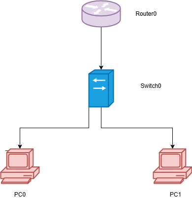

# 🏠 Basic Home Network Simulation using Cisco Packet Tracer

> A beginner-friendly project to simulate and understand basic home networking using Cisco Packet Tracer.

---

## 📌 Project Overview

This project simulates a simple home network consisting of a router, a switch, and two PCs. The goal is to demonstrate:
- IP configuration
- Device connectivity using ping
- Basic understanding of LAN setup

This is a great starting point for students or beginners who are learning computer networks and Cisco Packet Tracer.

---

## 🖥️ Topology Diagram

---

## 🛠️ Tools & Technologies

- **Cisco Packet Tracer** (v7.3 or above)
- **Diagrams.net (draw.io)** for topology design
- **Markdown** for documentation

---

## 🧪 Simulation Steps

### Step 1: Setup Devices
- Add a **router**, **switch**, and **2 PCs**
- Connect them using straight-through cables

### Step 2: Assign IP Addresses
| Device | Interface | IP Address     | Subnet Mask     |
|--------|-----------|----------------|------------------|
| Router | Fa0/0     | 192.168.1.1    | 255.255.255.0    |
| PC0    | NIC       | 192.168.1.2    | 255.255.255.0    |
| PC1    | NIC       | 192.168.1.3    | 255.255.255.0    |

### Step 3: Verify Connectivity
- Use the **ping** command from `PC0` to `PC1` and router
- Capture screenshots of successful pings

---

## ✅ Expected Output

- 🟢 PC0 and PC1 can ping each other
- 🟢 Both PCs can ping the router
- 🔴 No Internet access (not configured in this simple LAN)

---

## 🎯 Learning Outcomes

- 💡 Understand how devices in a LAN communicate
- 🔌 Learn basic cabling and interface configurations
- ⚙️ Practice using Cisco Packet Tracer simulation tools

---

## 🧠 Future Enhancements

- Add an Internet connection using a cloud device
- Configure static routes or DHCP server
- Extend to wireless network simulation

---

## 📚 Resources

- [Cisco Packet Tracer Download](https://www.netacad.com/courses/packet-tracer)
- [Diagrams.net (Draw.io)](https://draw.io)
- [Cisco Networking Basics](https://skillsforall.com/course/networking-basics)

---

## 🤝 Contributing

Pull requests are welcome! If you'd like to improve the simulation or convert it into a more advanced topology, feel free to fork and contribute.

---

## ✨ Author

Made with 💻 by [Ninja0x001](https://github.com/Ninja0x001)

